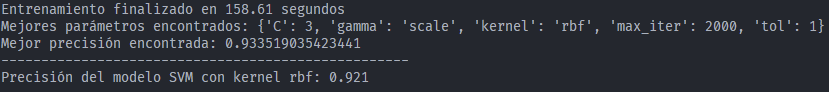
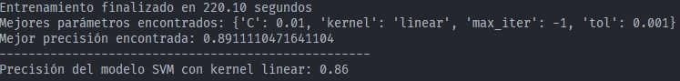
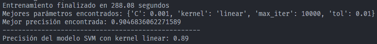
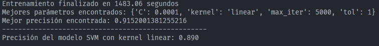
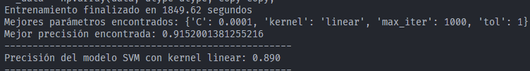
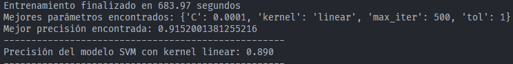
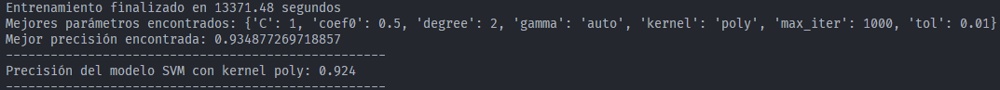
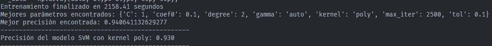
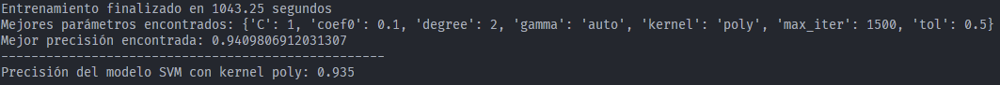

## RBF

Para el kernel rbf, hemos probado con los siguientes hiperparámetros:

```python

'rbf': {'kernel': ['rbf'], 'C': [3.5, 3], 'gamma': ['scale', 'auto'], 'tol': [1.5, 1], 'max_iter': [2000, 2500]},

```



Parece ser que en el rbf, no superamos una precisión mayor al 0.659. De momento, la mejor combinación de hiperparámetros es: ***{'C': 0.01, 'gamma': 'scale', 'kernel': 'rbf', 'max_iter': 1000, 'tol': 0.01}***.

Tampoco importa igualmente el tipo de hog que apliquemos, ya que los resultados son los mismos.


## Linear

```python
'linear': {'kernel': ['linear'], 'C': [0.01, 0.1, 1, 10], 'tol': [1e-2, 1e-3, 1e-4], 'max_iter': [1000, -1]},
```



```python
'linear': {'kernel': ['linear'], 'C': [0.001, 0.01, 0.1, 1, 100], 'tol': [1e-2, 1e-3, 1e-4], 'max_iter': [10000, -1]},
```



```python	
'linear': {'kernel': ['linear'], 'C': [1e-5, 1e-4, 0.001, 0.01, 0.1, 1, 100], 'tol': [1, 0.1, 1e-2, 1e-3, 1e-4], 'max_iter': [5000, 10000, 20000, -1]},
```





```python	
'linear': {'kernel': ['linear'], 'C': [9e-5, 1e-4, 11e-5, 0.001, 0.01], 'tol': [1.5, 1, 0.1, 1e-2], 'max_iter': [250, 500, 1000, 2000]},
```



```python	
'poly': {'kernel': ['poly'], 'C': [0.1, 1, 10, 100], 'degree': [1, 2, 3, 4, 8], 'gamma': ['scale', 'auto'], 'coef0': [0, 0.5, 1], 'max_iter': [1000, -1], 'tol': [1e-2, 1e-3, 1e-4]},
```



```python	
'poly': {'kernel': ['poly'], 'C': [0.75, 1], 'degree': [1, 2, 3], 'gamma': ['scale', 'auto'], 'coef0': [0.05, 0.1, 0.25], 'max_iter': [1000, 2500], 'tol': [1, 0.1]},
```



```python
'poly': {'kernel': ['poly'], 'C': [0.85, 1], 'degree': [1, 2], 'gamma': ['scale', 'auto'], 'coef0': [0.1, 0.15, 0.2], 'max_iter': [1500, 1000], 'tol': [0.75, 0.5]},
```

